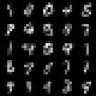
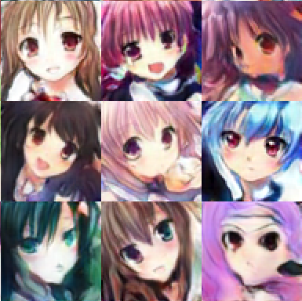
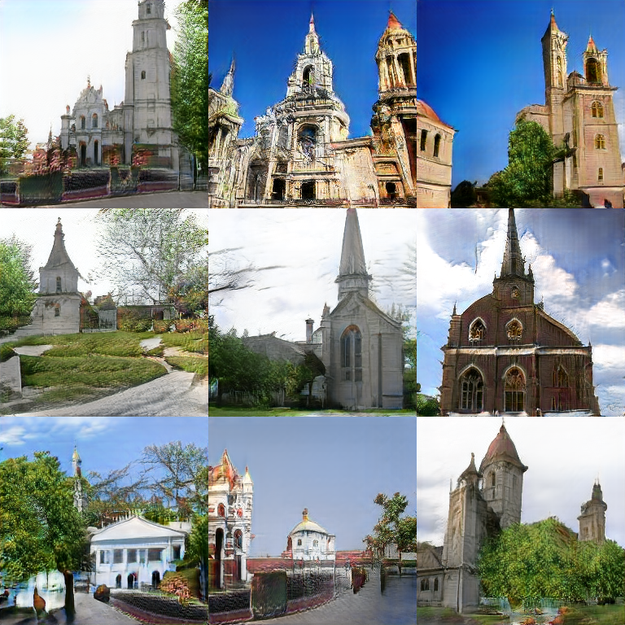
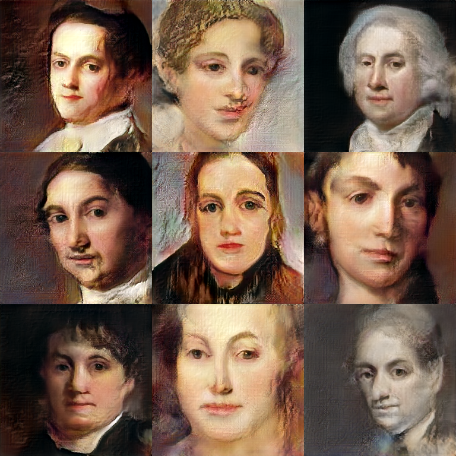
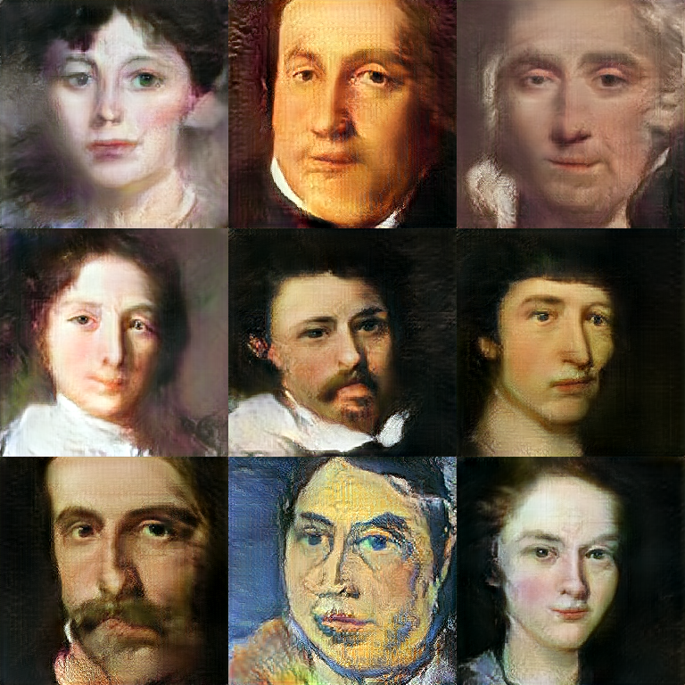
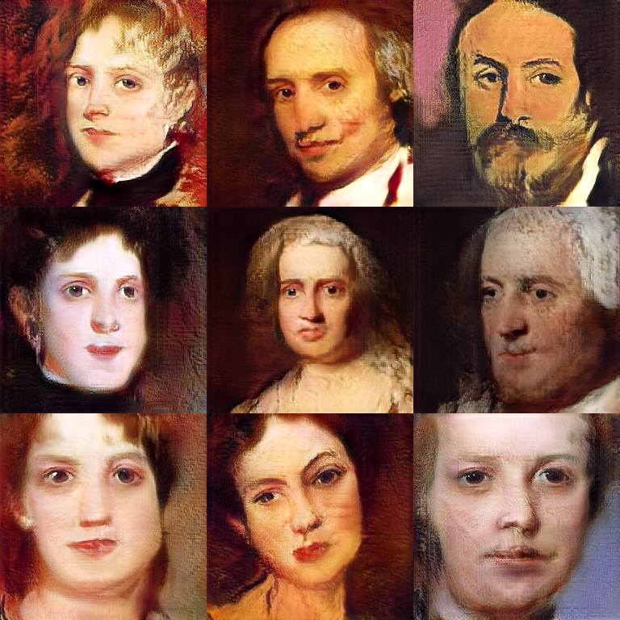

# Variational Gradient Flow for Deep Generative Learning
A tensorflow implementation of VGrow by using progressive growing method descriped in the following paper:
* [Deep Generative Learning via Variational Gradient Flow](https://arxiv.org/abs/1901.08469).
* [Progressive Growing of GANs for Improved Quality, Stability, and Variation](https://arxiv.org/abs/1710.10196).

## System requirements

* We only test our model on Linux. 
* 64-bit Python 3.6 and Tensorflow 1.12.0
* When you want to generate higher resolution image than 128x128, We recommend GPU with at least 16GB memory.
* NVIDIA driver 384.145  or newer, CUDA toolkit 9.0 or newer, cuDNN 7.1.2 or newer. We test the code based on the following two configuration.
  * NIVDIA driver 384.145, CUDA V9.0.176, Tesla V100
  * NVIDIA driver 410.93 , CUDA V10.0.130, RTX 2080 Ti
  
## Results
We train VGrow-Pg model based on different f-divergence such as KL-divergence, JS-divergence, Jef-divergence and our new porposed LogD-divergence. Here we only show the complete process of progressive growing based on KL-divergence. 

<table align='center'>
<tr align='center'>
<td> Resolution </td>
<td> 4x4 </td>
<td> 8x8 </td>
<td> 16x16 </td>
<td> 32x32 </td>
</tr>
<tr align='center'>
<td> MNIST </td>
<td>
<td>
<td>
<td>
</tr>
<tr align='center'>
<td> Fashion-MNIST </td>
<td>
<td>
<td>
<td>
</tr>
<tr align='center'>
<td> CIFAR-10 </td>
<td>
<td>
<td>
<td>
</tr>
</table>

<table align='center'>
<tr align='center'>
<td> Resolution </td>
<td> 4x4 </td>
<td> 8x8 </td>
<td> 16x16 </td>
</tr>
<tr align='center'>
<td> CelebA </td>
<td>
<td>
<td>
</tr>
<tr align='center'>
<td> Resolution </td>
<td> 32x32 </td>
<td> 64x64 </td>
<td> 128x128 </td>
</tr>
<tr align='center'>
<td> CelebA </td>
<td>
<td>
<td>
</tr>
</table>

<!-- <table align='center'>
<tr align='center'>
<td> Resolution </td>
<td> 4x4 </td>
<td> 8x8 </td>
<td> 16x16 </td>
</tr>
<tr align='center'>
<td> Cartoon </td>
<td>
<td>
<td>
</tr>
<tr align='center'>
<td> Resolution </td>
<td> 32x32 </td>
<td> 64x64 </td>
<td> 128x128 </td>
</tr>
<tr align='center'>
<td> Cartoon </td>
<td>
<td>
<td>
</tr>
</table>
 -->

<!-- <table align='center'>
<tr align='center'>
<td> Resolution </td>
<td> 4x4 </td>
<td> 8x8 </td>
</tr>
<tr align='center'>
<td> LSUN-Church (256x256) </td>
<td>
<td>
</tr>
<tr align='center'>
<td> Resolution </td>
<td> 16x16 </td>
<td> 32x32 </td>
</tr>
<tr align='center'>
<td> LSUN-Church (256x256) </td>
<td>
<td>
</tr>
<tr align='center'>
<td> Resolution </td>
<td> 64x64 </td>
<td> 128x128 </td>
</tr>
<tr align='center'>
<td> LSUN-Church (256x256) </td>
<td>
<td>
</tr>
<tr align='center'>
<td> Resolution </td>
<td> 256x256 </td>
<td> </td>
</tr>
<tr align='center'>
<td> LSUN (Church) </td>
<td>
<td> </td>
</tr>
</table>
 -->
### Other-divergence
We show all dataset final resolution results from each f-divergence.

<table align='center'>
<tr align='center'>
<td> </td>
<td> KL-divergence </td>
<td> JS-divergence </td>
<td> Jeffreys-divergence </td>
<td> logD-divergence </td>
</tr>
<tr align='center'>
<td> MNIST </td>
<td>
<td>
<td>
<td>
</tr>
<!-- <tr align='center'>
<td> Score </td>
<td> FID: 2.00 </td>
<td> FID: 1.85 </td>
<td> FID: 1.94 </td>
<td> FID: 2.15 </td>
</tr> -->
<tr align='center'>
<td> Fashion-MNIST </td>
<td>
<td>
<td>
<td>
</tr>
<!-- <tr align='center'>
<td> Score </td>
<td> FID: 5.20 </td>
<td> FID: 5.29 </td>
<td> FID: 5.55 </td>
<td> FID: 5.48 </td>
</tr> -->
<tr align='center'>
<td> CIFAR-10 </td>
<td>
<td>
<td>
<td>
</tr>
<!-- <tr align='center'>
<td> Score </td>
<td> FID: 20.70 </td>
<td> FID: 20.63 </td>
<td> FID: 20.27 </td>
<td> FID: 21.93 </td>
</tr> -->
<tr align='center'>
<td> LSUN-Bedroom </td>
<td>
<td>
<td>
<td>
</tr>
</table>

<table align='center'>
<tr align='center'>
<td> </td>
<td> KL-divergence </td>
<td> JS-divergence </td>
</tr>
<tr align='center'>
<td> CelebA </td>
<td>
<td>
</tr>
<tr align='center'>
<td> </td>
<td> Jeffreys-divergence </td>
<td> logD-divergence </td>
</tr>
<tr align='center'>
<td> CelebA </td>
<td>
<td>
</tr>
<tr align='center'>
<td> </td>
<td> KL-divergence </td>
<td> JS-divergence </td>
</tr>
<tr align='center'>
<td> LSUN-Church </td>
<td>
<td>
</tr>
<tr align='center'>
<td> </td>
<td> Jeffreys-divergence </td>
<td> logD-divergence </td>
</tr>
<tr align='center'>
<td> LSUN-Church </td>
<td>
<td>
</tr>
<tr align='center'>
<td> </td>
<td> KL-divergence </td>
<td> JS-divergence </td>
</tr>
<tr align='center'>
<td> Portrait </td>
<td>
<td>
</tr>
<tr align='center'>
<td> </td>
<td> Jeffreys-divergence </td>
<td> logD-divergence </td>
</tr>
<tr align='center'>
<td> Portrait </td>
<td>
<td>
</tr>
</table>

### Latent space manipulation
We first generate 10,000 faces using the network trained with CelebA dataset and KL divergence. We use the age and gender classification networks provided in https://github.com/dpressel/rude-carnie for those generated faces, and then find a latent direction that controls these semantics. For example, we apply a logistic regression for gender and regard the normal of decision boundary as the direction.

### Manipulating gender

### Manipulating age

## Usage 
### Command
We provide all arguments with default value and you can run this program with CIFAR-10 dataset by 
`bash cifar10.sh`. Training with other datasets is similar.

### Arguments in `train.py`
* `--gpu`: Specific GPU to use. *Default*: `0`
* `--dataset`: Training dataset. *Default*: `mnist`
* `--divergence`: f-divergence. *Default*: `KL`
* `--path`: Output path. *Default*: `./results`
* `--seed`: Random seed. *Default*: `1234`
* `--init_resolution`: Initial resolution of images. *Default*: `4`
* `--z_dim`: Dimension of latent vector. *Default*: `512`
* `--dur_nimg`: Number of images used for a phase. *Default*: `600000`
* `--total_nimg`: Total number of images used for training. *Default*: `18000000`
* `--pool_size`: Number of batches of a pool. *Default*: `1`
* `--T`: Number of loops for moving particles. *Default*: `1`
* `--U`: Number of loops for training D. *Default*: `1`
* `--L`: Number of loops for training G. *Default*: `1`
* `--num_row`: Number images in a line of image grid. *Default*: `10`
* `--num_line`: Number images in a row of image grid. *Default*: `10`
* `--use_gp`: Whether use gradient penalty or not. *Default*: `True`
* `--coef_gp`: Coefficient of gradient penalty. *Default*: `1`
* `--target_gp`: Target of gradient penalty. *Default*: `1`
* `--coef_smoothing`: Coefficient of generator moving average. *Default*: `0.99`
* `--resume_training`: Whether resume Training or not. *Default*: `False`
* `--resume_num`: Resume number of images. *Default*: `0`

## Link
The Portrait dataset is available at https://drive.google.com/file/d/1j_a2OXB_2rhaVqojzSPJLv_bDrSjHguR/view?usp=sharing

## Developer and Maintainer
Gefei WANG, HKUST

## Contact Information
Please feel free to contact Gefei WANG <gwangas@connect.ust.hk> or Prof. Can YANG <macyang@ust.hk> if any questions.
